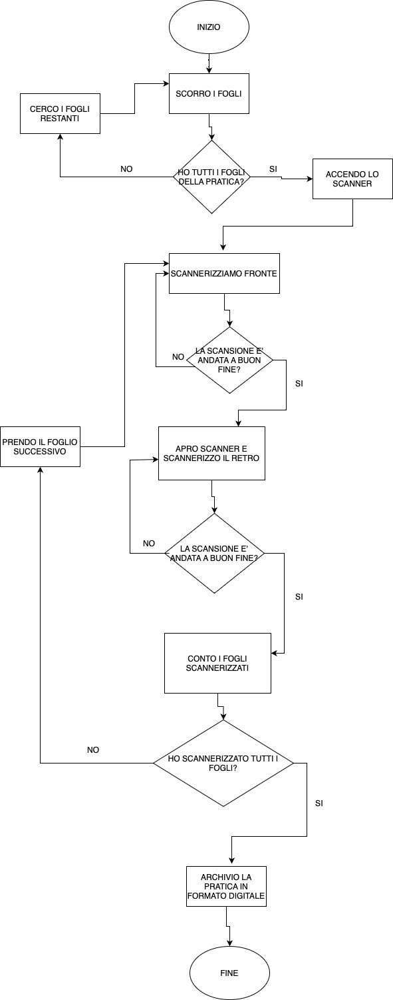

# Human Code

## Descrizione esercizio

In questo esercizio gli studenti del corso Boolean si approcciano ai linguaggi di programmazione affrontando un problema da rappresentare sotto forma di "human code" attraverso dei diagrammi di flusso, i quali dovranno esplicitare le scelte, le condizioni e i cicli necessari per arrivare a una soluzione interpretabile da un calcolatore o macchina.

## Testo esercizio

### Scansionare un documento su più fogli fronte-retro: La pratica perduta

Finalmente sono riuscito a ritrovare quella pratica che sembrava essere svanita nel nulla! Che poi, possibile che nel 2021 ci siano ancora così tanti fogli di carta in giro per l’ufficio?! Ora ci penso io: una bella scansione e l’archiviamo in formato digitale, così la prossima volta so già dove andare a cercarla! L’unica pecca è che lo scanner non ha il fronte-retro automatico e mi tocca farlo a mano. Va beh, poco male, almeno sono pochi fogli!

## Diagramma di flusso realizzato

